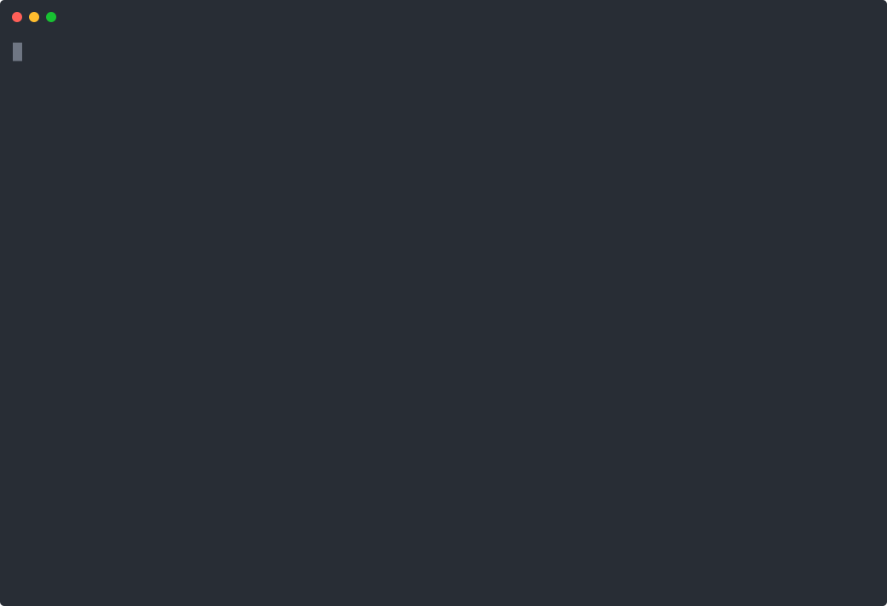

# Claude Code Starter Kit — Loops, Workflows & Skills


🇫🇷 [Version française](./README.fr.md) — the full theory guide (`docs/guide-complet.md`) and the skill bodies are currently written in French. Skill `description` fields — the part that drives automatic triggering — are in English, so the skills work the same regardless of your language.

A library of ready-to-use skills, subagents, and prompt templates for `/goal`, `/loop`, `/schedule` and dynamic workflows — get productive with Claude Code in minutes instead of iterating on prompts for weeks.

## See it work

Real recorded session (not a mock-up): the user asks for a review of their uncommitted diff — the `code-review` skill **triggers on its own** (`Skill(code-review)`), and the review comes back with severity labels, catching an off-by-one and an unexplained magic number:



And the `test-runner` subagent running an entire test suite in its own context, reporting **only the failure** — the verbose test output never touches your conversation:


## Quickstart

**Recommended — install as a Claude Code plugin** (one command, built-in updates):

```
/plugin marketplace add sharklandy/claude-code-starter-kit
/plugin install starter-kit-essentials@claude-code-starter-kit
```

`starter-kit-essentials` installs the core: 6 general-purpose developer skills plus the 4 subagents. For the whole kit (all 21 skills, wave-1 templates included):

```
/plugin install starter-kit-full@claude-code-starter-kit
```

Plugin skills are namespaced by plugin name (e.g. `/starter-kit-essentials:code-review`), which guarantees they never collide with skills you already have. To get updates: `/plugin marketplace update claude-code-starter-kit`.

**Alternative — physical copy** (editable files, short un-namespaced skill names):

```bash
git clone https://github.com/sharklandy/claude-code-starter-kit.git
cd claude-code-starter-kit
chmod +x install.sh
./install.sh --global   # or --local /path/to/your/project
```

Either way, paste the [onboarding prompt](./docs/onboarding-prompt.md) into Claude Code afterwards so the skills adapt themselves to your project.

## Why this kit

Writing good skills and good loop/workflow prompts takes time and many iterations. This repo collects generic, already-structured templates — trigger-oriented descriptions, a Gotchas section, progressive disclosure — so you adapt them to your stack instead of starting from a blank page. A full theory guide explains the "why" behind every pattern.

The kit distinguishes two waves of skills:

- **Wave 1 — templates derived from business use cases** (`-template` suffix): they illustrate a pattern through a concrete scenario (checkout flows, language migration, product-feedback triage) and need adapting to your own domain before use.
- **Wave 2 — general-purpose developer skills**: usable as-is on any project, whatever the stack, no prior reading required.

Skills live in two categories under `skills/`: `process/` for cross-cutting skills (independent of any technical domain) and `domains/` for domain skills (code review, test strategy...). A large domain skill follows **progressive disclosure** (see `docs/guide-complet.md`, Part 3.3): a short `SKILL.md` core that is always loaded, and a `reference/` subfolder with the details, which Claude only reads when the context calls for it — see `skills/domains/code-review/` as the reference example.

## Repository layout

```
claude-code-starter-kit/
├── README.md                     # this file
├── README.fr.md                  # French version (reference for docs)
├── LICENSE                       # MIT license
├── CONTRIBUTING.md               # how to contribute a skill/prompt
├── CHANGELOG.md                  # version history
├── install.sh                    # installs skills locally or globally
├── .claude-plugin/
│   └── marketplace.json          # Claude Code plugin marketplace (one-command install)
├── scripts/
│   ├── validate-skills.sh        # structural validator for skills/subagents (CI + local)
│   └── validate-skills-selftest.sh
├── docs/
│   ├── guide-complet.md          # full theory: loops, workflows, skills (French)
│   ├── glossaire.md              # quick glossary
│   ├── commandes-utiles.md       # command cheat-sheet
│   └── subagents-vs-skills.md    # when a subagent beats a skill
├── .claude/
│   └── agents/                   # ready-to-use subagents (installed by install.sh)
│       ├── code-reviewer.md      # fresh-context adversarial review
│       ├── test-runner.md        # isolated build/test/lint, reports failures only
│       ├── dependency-scout.md   # impact report before a dependency bump
│       └── bug-investigator.md   # reproduction + root-cause diagnosis
├── skills/
│   ├── process/                  # cross-cutting skills (19)
│   └── domains/                  # domain skills, progressive disclosure when large
│       ├── code-review/
│       │   ├── SKILL.md          # short core, always loaded
│       │   └── reference/        # detail loaded on demand
│       │       ├── security.md
│       │       ├── performance.md
│       │       └── database-queries.md
│       └── test-strategy/
├── goals/
│   └── goal-templates.md         # copy-paste-ready /goal prompts
├── workflows/
│   └── workflow-prompts.md       # one prompt per composition pattern
├── routines/
│   └── routine-templates.md      # full /schedule + /goal + workflow combos
└── .github/
    ├── workflows/
    │   └── validate.yml          # CI: skill validation + install.sh smoke test
    ├── ISSUE_TEMPLATE/
    └── PULL_REQUEST_TEMPLATE.md
```

## Installation with install.sh

`install.sh` detects every skill under `skills/process/` and `skills/domains/` (including the `reference/` subfolders of progressive-disclosure skills) and installs each one flat at the destination of your choice. It also installs the subagents from `.claude/agents/`.

**Global install** (available in all your projects, personal use):

```bash
./install.sh --global
```

Installs into `~/.claude/skills/` and `~/.claude/agents/`.

**Local install** (shared with anyone who clones the target project):

```bash
./install.sh --local /path/to/your/project
```

Installs into `/path/to/your/project/.claude/skills/` and `.claude/agents/`.

In both cases, if a skill with the same name already exists at the destination, the script asks for confirmation before overwriting, then prints a summary of what was installed and where.

## Getting started on a project

The whole journey is four steps: install (plugin or `install.sh`) → paste the [onboarding prompt](./docs/onboarding-prompt.md) into Claude Code → follow the instructions Claude gives you.

The onboarding prompt analyzes your situation and behaves accordingly:

- **Existing project**: Claude analyzes your code, dependencies, build/test/lint commands and git history, then fills in the `<TODO: ...>` placeholders of installed skills it can deduce with confidence — everything else is explicitly flagged as "fill in manually".
- **Blank project**: Claude guesses nothing from code that doesn't exist. It asks a few scoping questions (intended stack, application type, commit convention...), then classifies installed skills as "active now" vs "waiting" for the first real code.

If you're unsure which mechanism to pick (`/goal`, dynamic workflow, or a routine), use the `choose-your-loop` skill **before** grabbing anything from `goals/`, `workflows/` or `routines/`: it frames the task, detects a success criterion that's too vague, and validates (or corrects) the choice before writing the final prompt.

## Adapting the templates to your stack

The [onboarding prompt](./docs/onboarding-prompt.md) automates the placeholder filling. If you prefer doing it by hand:

1. Keep the existing structure — in particular, never empty the `## Gotchas` section: it's the highest-signal content of a skill (see `docs/guide-complet.md`, Part 3.3).
2. Test that the skill actually triggers in a real Claude Code session: if it doesn't fire spontaneously on a relevant task, the frontmatter `description` probably isn't explicit enough about the keywords that should activate it.
3. Grow the Gotchas section over time, with every new pitfall you hit, instead of only fixing the isolated case.

## Subagents: tasks that deserve their own context

Beyond skills, the kit ships four ready-to-use **subagents** (`.claude/agents/`, installed by both the plugin and `install.sh`). A subagent runs in a separate context window, with its own tool restrictions, and returns only its summary — where a skill guides the main conversation:

- **`code-reviewer`** — fresh-context adversarial review: the agent hasn't seen how the code was written, cannot edit it, and preloads the `code-review` domain skill as its review framework.
- **`test-runner`** — runs build/tests/lint (detected from the project's CI) and reports only the failures; verbose test output never pollutes your conversation.
- **`dependency-scout`** — before a dependency bump, absorbs changelogs and usage searches, and returns an impact report; it never applies the update itself.
- **`bug-investigator`** — reproduces, bisects, and confirms a bug's root cause, then returns a diagnosis with evidence; the fix is decided in the main conversation.

Three of them have **persistent per-project memory** (`memory: project`): risk areas, confirmed CI commands, flaky tests, bug patterns — knowledge that accumulates across sessions and is shared through git instead of being rediscovered every time.

To decide when a subagent beats a skill (and why most building blocks should stay skills), see [`docs/subagents-vs-skills.md`](./docs/subagents-vs-skills.md).

## Using the /goal, /loop, /schedule and workflow prompts

- [`goals/goal-templates.md`](./goals/goal-templates.md) — ready-to-use `/goal` prompts (tests, performance, migration, security...), each with an explicit retry cap.
- [`workflows/workflow-prompts.md`](./workflows/workflow-prompts.md) — one prompt per composition pattern (classify-and-act, split-and-synthesize, parallel research, adversarial review, tournament, loop-until-done).
- [`routines/routine-templates.md`](./routines/routine-templates.md) — complete `/schedule` + `/goal` + workflow combinations for fully autonomous flows.

## Going further

The full theory behind these templates — agentic loops, failure modes of dynamic workflows, skill categories, step-by-step tutorials — lives in [`docs/guide-complet.md`](./docs/guide-complet.md) (currently in French; an English translation is on the roadmap if there's demand).

## Contributing

Contributions are welcome — see [`CONTRIBUTING.md`](./CONTRIBUTING.md) for the expected skill structure, naming conventions, and the non-empty-Gotchas requirement. Every PR runs the structural validator (`scripts/validate-skills.sh`) in CI; you can run it locally before pushing.

## License

Distributed under the [MIT](./LICENSE) license.
